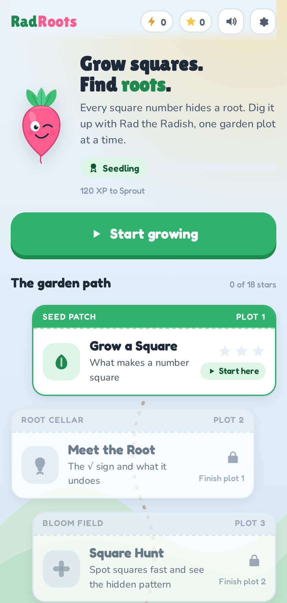
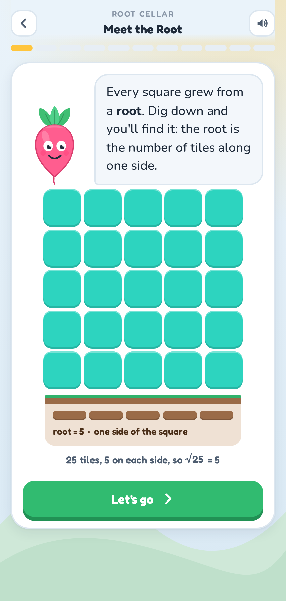
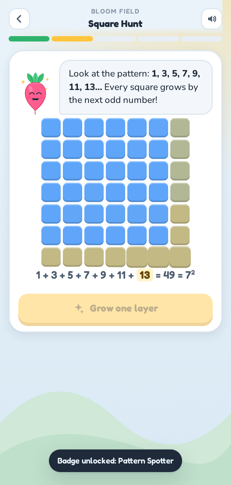

# Rad Roots

**A square-root garden for kids aged 8 to 12.** Grow squares out of tiles, dig up their roots, bust the classic mix-ups, and race the clock, guided by Rad the Radish.

<p align="center">
  
  
  
</p>

## Play it now

**https://anwaryu.github.io/Repo1/** works on any phone, tablet or computer. No account, no login, nothing to install.

On a phone it can live on the home screen like an app: full screen, its own icon, and it keeps working without a signal.

- **iPhone or iPad:** open the link in Safari, tap Share (the square with an arrow), then *Add to Home Screen*.
- **Android:** open the link in Chrome and tap *Install* on the tip Rad shows, or use the browser menu and choose *Add to Home screen*.

Every push to this branch republishes the site: `.github/workflows/pages.yml` copies the app into the `gh-pages` branch, which GitHub Pages serves. That branch is generated output, so never edit it by hand.

## Why a garden, and why a radish?

Square roots are usually introduced as a symbol to memorise. Rad Roots introduces them the way they were discovered: **a square number is literally a square of tiles, and its root is the length of one side.** A 25-tile square has 5 tiles on each side, so √25 = 5. Once that picture is in a child's head, the symbol has somewhere to land.

The mascot is not decoration. The √ sign is called the *radical*, from the Latin *radix*, meaning root. The word *radish* comes from the same root. Rad tells kids this in the first minute, and the whole garden metaphor (roots underground, squares blooming above) follows from it.

## The learning path

Seven plots, each targeting one idea, each ending in a short mastery check. Stars reward accuracy (3 stars at 90%), never speed, until the optional Greenhouse.

| Plot | Place | Idea | What the child actually does |
| --- | --- | --- | --- |
| 1 | Seed Patch | Square numbers | Slides a square from 1×1 to 12×12; sorts tile counts into *square* / *not square* and watches leftover tiles fall off |
| 2 | Root Cellar | The √ sign as the inverse of squaring | Sees the root drawn under the square; runs a machine where the SQUARE and ROOT levers undo each other |
| 3 | Bloom Field | The odd-number pattern, fast recognition | Adds layers and discovers 1 + 3 + 5 + 7 = 16; then catches square numbers as they pop out of the soil |
| 4 | Wild Meadow | Estimating roots of non-squares | Traps √50 between 7 and 8; drags a pin on a zoomed number line and is scored on closeness |
| 5 | Weed Patrol | Misconceptions | Pulls the weeds: √16 = 8 (root is not half), 5² = 10 (squaring is not doubling), √25 = 12.5 … |
| 6 | Big World | Application | Vegetable patches, pixel pictures, marching bands, chessboards, a rug's area |
| 7 | Greenhouse | Fluency (bonus) | A 60-second Root Rush with streak bonuses, unlocked only after all six plots earn a star |

Each plot's design follows concrete → pictorial → abstract. Direct manipulation (sliders, levers, dragging, tapping) carries the thinking wherever it can; multiple choice is used only where the choice *is* the skill (which two whole numbers is √50 between?).

## Gamification, deliberately limited

Rewards are attached to skills, not to time spent:

- **Stars** per plot, based on accuracy. Any plot can be replayed for three.
- **XP and ranks** (Seedling → Sprout → Sapling → Bloomer → Root Master) for every correct answer and every goal met.
- **Eleven badges** such as *Square Builder* (grew all twelve squares), *Root Finder* (undid a square with the machine), *Root Detective* (three estimates within a whisker) and *Myth Buster* (pulled every weed).
- **No lives, no leaderboards, no timers** until the concept is secure. A wrong answer opens a hint and a second try; a second miss shows the answer with its reason.

## Design system

- **Type:** Lilita One for the wordmark and big celebratory numbers, Fredoka for UI and maths, Nunito for reading. Loaded from Google Fonts with rounded system fallbacks.
- **Colour:** a morning-garden palette (sky ground, leaf green, sun yellow, radish pink, soil brown), with a night-garden dark theme via `prefers-color-scheme`. Every perfect square from 1 to 144 has its own tile hue, so 49 is always blue and 100 always fuchsia.
- **Components:** seed-packet cards for the plots (a coloured band, a perforated tear line), chunky pressable buttons, a jelly-tile grid, a plant view with the root drawn in the soil, a number pad, a zoomed number line, and a bottom feedback sheet.
- **Sound:** short synthesised pops, chimes and fanfares from the Web Audio API. No audio files; one tap to mute.
- **Motion:** staggered tile pop-ins, spring buttons, confetti on completion. All of it respects `prefers-reduced-motion` and an in-app toggle.
- **Built for phones:** 44px+ touch targets, no sticky hover states, no accidental text selection, safe-area padding for notched screens, layouts tuned down to 320px and for short landscape phones. A web app manifest and service worker make it installable and playable offline.

The full rationale is in [docs/DESIGN.md](docs/DESIGN.md).

## Accessibility

- Every control is a real button or input; everything works from the keyboard (digits and Enter for answers, arrow keys on the number line, Escape for dialogs).
- Visible focus rings, 44px+ touch targets, body text contrast above 4.5:1 in both themes.
- Colour never carries meaning alone: correct and incorrect states also change icon, shape and text.
- ARIA roles and labels on grids, sliders, progress bars and live regions.

## Running it

No build step, no dependencies. Any of these works:

```bash
# 1. Just open the file
open index.html

# 2. Or serve the folder (Node 18+)
npm start            # http://localhost:5173

# 3. Or any static server
python3 -m http.server 5173
```

To produce a single self-contained HTML file for sharing or hosting:

```bash
npm run build        # writes dist/rad-roots.html
```

Progress (stars, XP, badges, settings) is saved in `localStorage` on the device. The settings gear has a reset for a new learner.

## Project layout

```
index.html          shell, fonts, script order
manifest.webmanifest  home-screen app metadata and icons
sw.js               service worker: app shell cached for offline play
icons/              Rad as app icons (SVG sources and rendered PNGs)
css/styles.css      tokens (light + dark), layout, every component
js/util.js          DOM helper, shuffle, isSquare
js/icons.js         inline SVG icon set, the radical sign, star rows
js/mascot.js        Rad the Radish in five moods
js/sfx.js           Web Audio sound effects
js/confetti.js      canvas confetti
js/store.js         progress, ranks, badges, localStorage
js/widgets.js       tile grid, plant view, slider, number pad, number line, scenes, feedback sheet
js/steps.js         the twelve step types that make up a lesson
js/levels.js        the seven plots: all copy and content
js/app.js           screens, level runner, completion, settings, boot
scripts/serve.mjs   tiny static server (npm start)
scripts/build.mjs   single-file bundler (npm run build)
scripts/make-icons.mjs  renders the PNG icons from the SVGs (npm run icons)
.github/workflows/pages.yml  deploys to GitHub Pages on push
vercel.json         headers for hosting the same folder on Vercel
docs/DESIGN.md      learning design and visual design rationale
docs/screenshots/   captured from the real app
```

## For parents and teachers

There is a page inside the app (home → *Parents & teachers*) that explains the pedagogy, maps plots to skills, and suggests three activities to try away from the screen.
